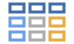

# SummaryTables

<!-- badges: start -->

<!-- badges: end -->

Publication-ready summary tables for [jamovi](https://www.jamovi.org).

SummaryTables lets you create professional descriptive statistics tables
directly in jamovi — no code required. Built on the
[gtsummary](https://www.danieldsjoberg.com/gtsummary/) R package.

## Features

- **Descriptive statistics** for continuous variables (mean, SD, median,
  IQR, range) and categorical variables (counts, percentages)
- **Group comparisons** — split tables by a grouping variable (Table 1 style)
- **Statistical tests** — t-test, ANOVA, Wilcoxon rank-sum, Kruskal-Wallis,
  Chi-square, Fisher's exact test
- **Effect sizes** — Cohen's d, Hedge's g, SMD, and more
- **Confidence intervals** — for means, medians, and proportions with
  multiple methods (Wilson, Clopper-Pearson, Wald, Agresti-Coull, Jeffreys)
- **P-value adjustment** — Benjamini-Hochberg, Bonferroni, Holm, and others
- **Journal themes** — JAMA, The Lancet, NEJM, Quarterly Journal of Economics
- **16 languages** — English, French, German, Spanish, Chinese, Japanese,
  Korean, and more
- **Per-variable control** — override statistics, tests, and methods for
  individual variables
- **Word export** — save tables directly as .docx files
- **Missing data handling** — show, hide, or always display with
  customizable labels

## Acknowledgments

SummaryTables is powered by:

- [gtsummary](https://www.danieldsjoberg.com/gtsummary/) — the engine
  for summary table creation
- [gt](https://gt.rstudio.com/) — table rendering
- [flextable](https://ardata-fr.github.io/flextable-book/) — Word export
