---
hide:
  - navigation
---

# User Guide

This guide highlights important notes, default behaviors, and specific options you should be aware of when using SummaryTables.

## Which Table Should I Use?

A quick reference guide for choosing the right table based on your data and goals:

* **Table 1 / Main Summary:** Use the **Summary Table** without a grouping variable for a general overview.
* **Categorical Outcome:** Use the **Summary Table** with your outcome assigned to the **Grouping Variable**.
* **Continuous Outcome:** Use the **Continuous Table**.
* **Only Two Categorical Variables:** Use the **Cross Table** for a straightforward cross-tabulation.
* **Likert Scale Data:** Use the **Likert Table**.
* **Survival Analysis:** Use the **Survival Table** for Kaplan-Meier estimates and survival statistics.
* **Regression Models:** Use **Univariable Regression** (fits a separate model for each variable) or **Multivariable Regression** (fits a single combined model).

---

## General Behaviors & Features

### Manual Run Mode

By default, jamovi automatically runs an analysis every time you change a setting. Because SummaryTables does not cache or save any previous outputs, it must build the entire table from scratch on every single run. 

This creates a severe cumulative calculation overhead. Any individual action triggers a full run. For example, when using **Univariable Regression**:

* If you drag and drop 10 variables *one by one*, jamovi triggers 10 separate runs. The 1st run fits 1 model to build the first table. When you add the second variable, it doesn't just add a model to the existing table; the old table is discarded, and it builds a new table from scratch by fitting the first model again *and* the new second model. The 3rd run fits 3 models from zero, and so on. By the time you add the 10th variable, the module has needlessly fitted a total of *55 models* (1+2+3+...+10).
* The same applies to options: changing 5 different checkboxes one after another triggers 5 complete recalculations of the entire table.

To prevent this snowballing delay, you can enable *Manual Run Mode*.

<figure markdown="span">
  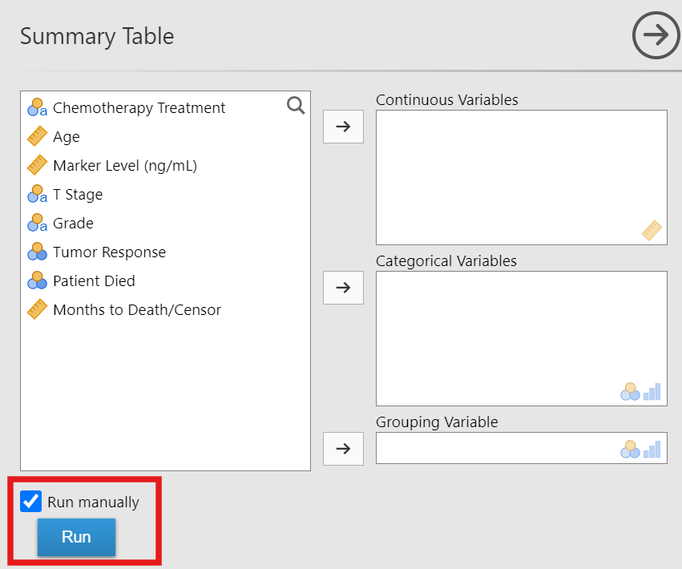{ loading=lazy width="500" }
</figure>

Checking the **"Run manually"** option disables the auto-run behavior and activates the **"Run"** button. This allows you to add all 10 variables at once and set all your options without triggering any calculations. Once everything is set up, click **"Run"** to calculate the final table exactly once—fitting just the *10 models* you actually need. This saves a huge amount of time, especially for computationally heavy tables like regressions.

### Save to Word

SummaryTables allows you to save any table directly as a `.docx` file for easy inclusion in manuscripts. To use this feature, simply type the complete folder location where you want to save the file, followed immediately by your desired file name ending in `.docx` into the **Path** text box, and then click the **Save** button. The module produces *native Word tables* and accurately *preserves the styling and formatting* of the table.

<figure markdown="span">
  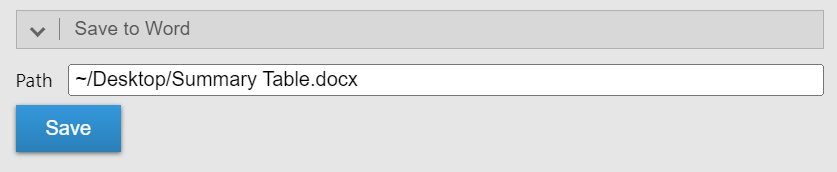{ loading=lazy width="500" }
</figure>

!!! warning "Overwriting Files"
    When saving a table, if you type a filename that already exists in your chosen folder, the module will *silently overwrite the entire existing Word file* without a warning prompt. Please double-check your folder path and filename before clicking **Save** to avoid accidentally deleting an older document.

!!! info "Cloud Limitation"
    Please note that the "Save to Word" feature is *not available on the cloud version of jamovi* due to security limitations.

### Rounding

SummaryTables provides two distinct sets of rounding options: one for general statistics, and one specifically tailored for p-values.

#### General Statistics

You can independently set the rounding rules for various elements in your tables (such as summary statistics, coefficients, and confidence intervals) using the **Decimal places** dropdowns.

<figure markdown="span">
  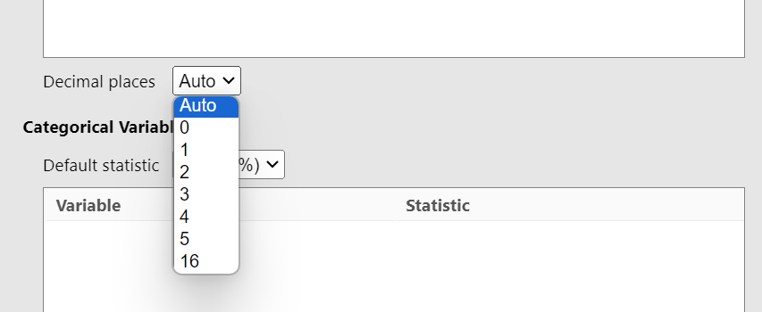{ loading=lazy width="500" }
</figure>

* **Auto (Default):** Typically uses adaptive decimal places, though certain themes may affect this behavior.
* **Fixed (0-5, 16):** Uses a fixed number of decimal places.

#### P-Values

The p-value dropdown controls the rounding of *large* p-values, while precision automatically increases as p-values get smaller.

<figure markdown="span">
  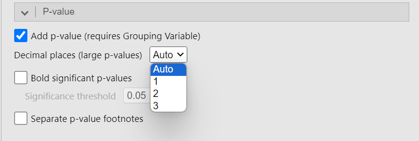{ loading=lazy width="500" }
</figure>

* **Auto (Default):** Depends on the theme (the default theme uses **"1"**).
* **1:** Large p-values are rounded to one decimal place. Precision increases as p-values decrease, and very small values are shown as `<0.001`.
* **2:** Large p-values are rounded to two decimal places. Precision increases as p-values decrease, and very small values are shown as `<0.001`.
* **3:** Large p-values are rounded to three decimal places. Precision increases as p-values decrease, and very small values are shown as `<0.001`.

### Statistical Tests

The module automatically selects appropriate statistical tests based on your data types and the number of groups across the **Summary Table**, **Continuous Table**, and **Cross Table**. You can configure this behavior in the **Default test** dropdowns:

#### Continuous Variables

<figure markdown="span">
  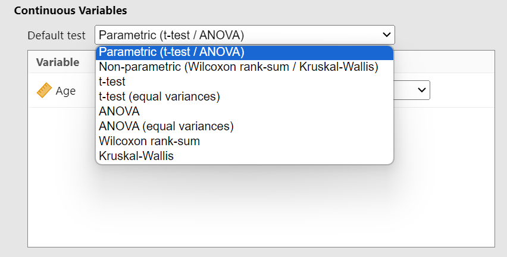{ loading=lazy width="500" }
</figure>

* **Parametric (Default):** Uses the independent t-test (not assuming equal variance) for 2 groups, or one-way ANOVA (not assuming equal variance) for >2 groups.
* **Non-parametric:** Uses the Wilcoxon rank-sum test for 2 groups, or Kruskal-Wallis rank-sum test for >2 groups.

!!! info "Grouping Variable in the Continuous Table"
    If you assign a **Grouping Variable** in the **Continuous Table**, the module automatically calculates p-values using a two-way ANOVA. In this specific configuration, no other statistical tests can be applied.

#### Categorical Variables

<figure markdown="span">
  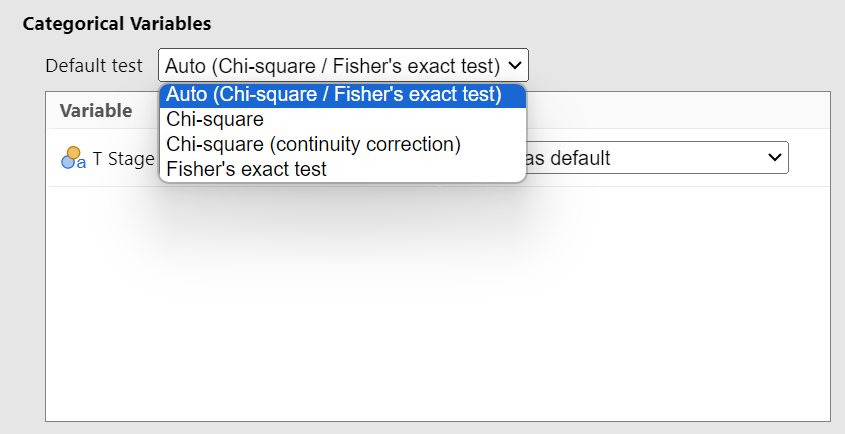{ loading=lazy width="500" }
</figure>

* **Auto (Default):** Uses Pearson's Chi-square test (without continuity correction) if all expected cell counts are ≥ 5. It automatically falls back to Fisher's exact test if any expected cell count is < 5.

#### Variable-Specific Tests

<figure markdown="span">
  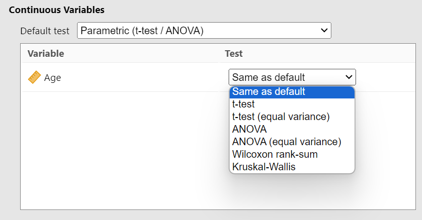{ loading=lazy width="500" }
</figure>

If you want specific tests for specific variables, you can manually select a different test for individual variables. For example, if your default is set to **Parametric (t-test / ANOVA)**, you can manually set a specific variable to use the **Wilcoxon rank-sum** test.

---

## Table-Specific Notes

### Summary Table: Difference

!!! info "SMD Method Calculation"
    When you select the **SMD** option as your **Difference** method, the values are calculated using the [`smd` R package](https://bsaul.github.io/smd/index.html).

    <figure markdown="span">
      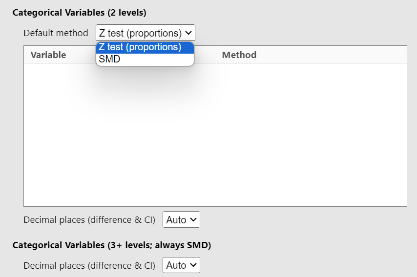{ loading=lazy width="500" }
    </figure>

!!! failure "Multiple P-Value Columns Error"
    If you select a **Difference** method that generates a p-value and you also check **P-value** under the general **P-value** section, an error will occur. The table cannot display multiple p-value columns simultaneously.

    <figure markdown="span">
      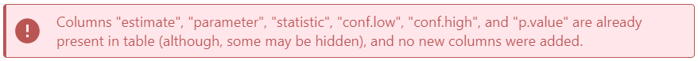{ loading=lazy width="500" }
    </figure>

### Regression Tables: Univariable vs. Multivariable

It is important to understand the fundamental difference in how the **Univariable Regression** and **Multivariable Regression** tables are constructed:

* **Univariable Regression:** Fits *one separate model per predictor*. If you add 5 variables across the **Covariates** and **Factors** lists, the module will fit 5 distinct simple regression models (each predicting the dependent variable using just that one predictor) and combine the results into a single table.
* **Multivariable Regression:** Fits *one single model containing all predictors*. If you add 5 variables across the **Covariates** and **Factors** lists, the module will fit a single model where all 5 variables are included simultaneously, adjusting for each other.

### Regression Tables: Standardized Coefficients

For linear regression models, SummaryTables allows you to report standardized coefficients.

<figure markdown="span">
  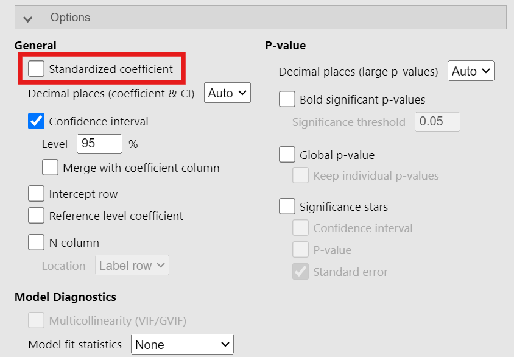{ loading=lazy width="500" }
</figure>

!!! info "Difference from SPSS"
    If you are coming from SPSS, your results might look different because SPSS standardizes all variables, whereas we do not standardize **Factors**. We only standardize continuous variables (including **Covariates** and the **Dependent Variable**). This approach—which is also used by jamovi's default linear regression and GAMLj—is comparable to the "refit" method in the [`parameters` R package](https://easystats.github.io/parameters/reference/standardize_parameters.html#details).

### Survival and Cox Regression: Event Variable Coding

When using the **Survival Table** or **Cox Regression** analyses, the **Event variable** must be coded correctly:

<figure markdown="span">
  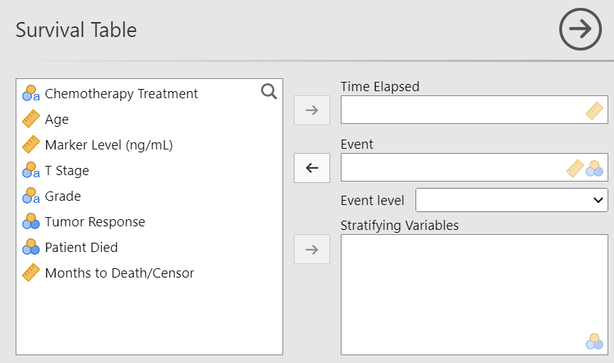{ loading=lazy width="500" }
</figure>

* **If continuous:** You can use either `0` and `1` (0 = censored, 1 = event) OR `1` and `2` (1 = censored, 2 = event). Any other numeric values will cause an error.
* **If categorical:** You must select the specific level that represents the event from the **Event level** dropdown.